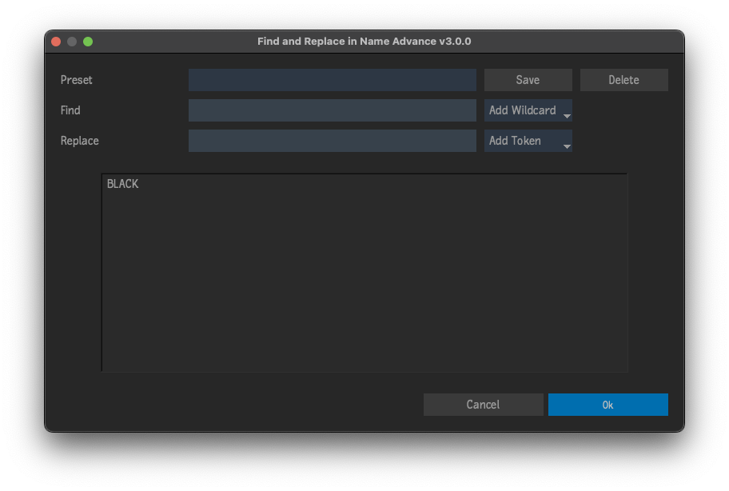

# Find and Replace in Name Advance

Plugin for [Autodesk Flame software](http://www.autodesk.com/products/flame).

Perform find & replace operation on the names of the selected Desktop or MediaHub items.

Supports wildcards in the Search field, tokens in the Replace field, and
the ability to save and load presets.

## Tokens
- `am/pm`
- `AM/PM`
- `Day`
- `Hour (12hr)`
- `Hour (24hr)`
- `Minute`
- `Month`
- `Project`
- `User`
- `Year (YY)`
- `Year (YYYY)`

## Wildcards
- `Match Any`
- `Match All`
- `Match End`
- `Match Start`

## Installation
**Tested & working on 2021.1**

To make available to all users on the workstation, copy `find_replace_in_name_advance.py` to `/opt/Autodesk/shared/python`

For specific users, copy to `/opt/Autodesk/user/<user name>/python`

## Menus
- Right-click selected items on the Desktop `->` Edit... `->` Find and Replace in Name Advance
- Right-click selected items on the Media Hub `->` Edit... `->` Find and Replace in Name Advance

## Acknowledgements
UI Templates courtesy of [pyflame.com](http://www.pyflame.com)

Inspired by [Find and Replace in Name](http://www.dropbox.com/sh/x5o5bdxn5m6gy9d/AADX6RYQmN3JoT-ofrff5ETVa/Scripts/find_and_replace_in_name?dl=0&subfolder_nav_tracking=1)
